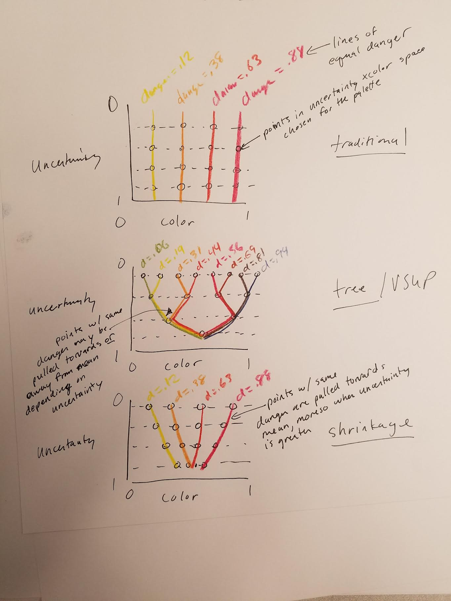
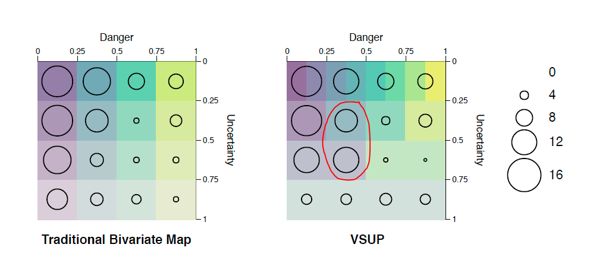

## Introduction

I was reading through the VSUP paper and it occurred to me that there is a connection between this and the idea of shrinkage in hierarchical models --- specifically, for groups with higher uncertainty in hierarchical models, estimates will be pulled more towards the mean, making them more conservative (or, say, information from more certain groups is borrowed to improve estimates in groups that are less certain). Another way of viewing this is as a form of regularization.

At first I thought that that is what VSUPs would do, but then I realized they do so inconsistently --- sometimes they pull values towards the mean, and sometimes they actually pull values away from the mean. I tried to illustrate:



The tree-based VSUP leads to situations where the color value for some cells move towards the mean at some levels of uncertainty and away from the mean at other levels of uncertainty, which I think might explain some results like people being more likely to select certain strictly worse cells, circled here (the lower of the two circled cells has equal danger but higher uncertainty, so there is not really a situation I can think of where one would want it to be more likely to be selected):



I really like the general idea of making estimates more conservative under higher uncertainty by manipulating the encoding. I wondered if connecting this to a shrinkage estimator might yield a similar sort of palette but where the color is always pulled towards the mean, making reversals like the one above less likely. The thing that might be lost is the additional fidelity at high-certainty ends of the scale.

There's a Bayesian framing to the regularization approach as well which Michael and I discussed a bit already: that at higher uncertainty, the prior dominates, and when uncertainty is low, the data dominates. The nice thing is that all these things turn out to be different sides of the same coin (regularization/shrinkage, hierarchical models, and a Bayesian view where the shrinkage is determined by a prior). 

In the rest of this document I'm going to try to actually build some VSUP-like-things using regularization / a Bayesian perspective.

## Setup

```{r setup, warning = FALSE, message = FALSE}
library(tidyverse)
library(magrittr)
library(rstan)
library(brms)
library(tidybayes)
library(ggstance)
library(modelr)
library(patchwork)

options(mc.cores = parallel::detectCores())
rstan_options(auto_write = TRUE)
theme_set(theme_light())
```

### Load data

Load the polling data...

```{r}
polls = read_csv("examples/polling.csv",
  col_types = cols(
    State = col_character(),
    Date = col_character(),
    `Hillary Clinton` = col_number(),
    `Donald Trump` = col_number(),
    `Gary Johnson` = col_number(),
    `Jill Stein` = col_number(),
    `Evan McMullin` = col_number(),
    `Margin of error` = col_number(),
    Lead = col_number(),
    `Clinton potential EVs` = col_number(),
    `Trump potential EVs` = col_number(),
    `Tied potential EVs` = col_number(),
    Result = col_double()
  ),
  na = c("", "Tied")
) %>%
  mutate(
    #need to recalculate this as it is not signed in the data
    lead = `Hillary Clinton` - `Donald Trump`,
    se = `Margin of error`
  )
```

## Regularizing the estimates

We'll make a few assumptions:

1. `Margin of error` in the table is the standard error
2. Everything is Gaussian so we can use a Gaussian conjugate prior to regularize

We'll use an empirical 0-centered prior by taking the variance of all the leads *as if the mean lead were actually 0* (which it isn't, it is slightly less than 0) as the variance of our prior. That is:

```{r}
prior_var = mean(polls$lead ^ 2)
```

Thus our prior is _N_(0, `prior_var`) = _N_(0, `r prior_var`). I chose 0-centered here (rather than centered on the actual mean, which is `r mean(polls$lead)`, because of some half-remembered argument from Michael that 0-centered is more neutral in polling data. You could equally as well do everything that follows from here by shrinking towards sample mean instead of assuming a mean of 0. The variance would change a bit, as would the calculation of the adjusted mean.

We will regularize by adjusting each mean `lead` to be the posterior mean from a Gaussian model if we had used _N_(0, `r prior_var`) as the prior on the mean. That is, if the sample mean is $\bar{x}$ (here, `lead`), the margin of error is $\sigma_\bar{x}$ (here, `se`), and the variance of the prior is $\sigma_0^2$ (here `prior_var`), then the posterior mean $\mu_n$ is (based on [this](https://www.cs.ubc.ca/~murphyk/Papers/bayesGauss.pdf) plus some re-arranging and substitution):

$$
\mu_n = \frac{\bar{x}}{1 + \frac{\sigma_\bar{x}^2}{\sigma_0^2}}
$$

Thus:

```{r}
polls %<>% mutate(
  lead_adj = lead / (1 + se^2 / prior_var)
)
```

Let's see what the adjustment (aka shrinkage aka regularization) looks like:

```{r, fig.width = 10, fig.height = 5}
set.seed(123456)
polls %>%
  mutate(y = -runif(n())/sqrt(prior_var)/5) %>%
  ggplot(aes(y = y, yend = y, xend = lead, x = lead_adj)) +
  stat_function(
    fun = function(x) dnorm(x, 0, sqrt(prior_var)),
    geom = "area", xlim = c(-50, 50), fill = "gray85"
  ) +
  geom_segment(size = 0.75, color = "red") +
  geom_point(size = 1.5) +
  geom_vline(xintercept = 0, linetype = "dashed") +
  annotate(
    "text", x = 37, y = 0.004, label = "prior", color = "gray50",
    hjust = 0, fontface = "bold"
  ) +
  annotate(
    "text", x = 37, y = -0.0088, label = "shrinkage", color = "red", 
    hjust = 0, fontface = "bold"
  ) +
  scale_y_continuous(breaks = NULL) +
  ylab(NULL)
```

Black dots indicate the adjusted lead; red lines show shrinkage/regularization from the unadjusted values. Values with greater shrinkage will be a result of some combination of being further from 0 and having more uncertainty.

To get a sense of how error and distance from 0 interact to produce shrinkage, let's try to see what that looks like over the space of values in the data (__Note:__ in this plot, `se` increases as you go downwards for consistency with the way the color palettes are drawn):

```{r}
polls %>%
  data_grid(
    lead = max(abs(lead)) %>% seq(-., ., length.out = 19),
    se = seq_range(se, n = 20)
  ) %>%
  mutate(lead_adj = lead / (1 + se^2 / prior_var)) %>%
  ggplot(aes(y = se, yend = se, xend = lead, x = lead_adj)) +
  geom_segment(size = 0.75, color = "red") +
  geom_line(aes(group = lead), color = "gray75") +
  geom_point(size = 1.5) +
  scale_y_reverse() +
  theme(panel.grid.major.x = element_blank(), panel.grid.minor.x = element_blank()) +
  xlab("Adjusted lead (connected dots have the same unadjusted lead)")
```

## Regularized VSUPs

### On the original data

Okay, let's try to define some small number of cells based on this to make a color scale...

```{r}
build_scale = function(min_lead, max_lead, min_se, max_se, prior_var_ = prior_var) {
  crossing(
    lead = seq(min_lead, max_lead, length.out = 5),
    se = seq(min_se, max_se, length.out = 5)
  ) %>%
  group_by(lead) %>%
  mutate(
    prev_se = lag(se),
    se_mid = (prev_se + se)/2
  ) %>%
  group_by(se) %>%
  mutate(
    prev_lead = lag(lead), 
    lead_mid = (lead + prev_lead)/2,
    lead_adj = lead / (1 + se_mid^2 / prior_var_),
    prev_lead_adj = lag(lead_adj),
    lead_mid_adj = lead_mid / (1 + se_mid^2 / prior_var_)
  ) %>%
  drop_na()
}

scale_data = polls %$%
  build_scale(-max(abs(lead)), max(abs(lead)), min(se), max(se))
```

Then compare the two versions. First, we'll color each cell by the value of `lead` at its midpoint (left plot) then by the adjusted (shrunken / regularized) value at its midpoint (right plot):

```{r fig.width = 6, fig.height = 3}
draw_scale = function(scale_data, color_by = "lead_mid") {
  scale_data %>%
    mutate(lead_mid = !!sym(color_by)) %>%
    ggplot(aes(
      xmin = prev_lead, xmax = lead, 
      ymin = prev_se, ymax = se, alpha = -se_mid, fill = lead_mid
    )) + 
    geom_rect() +
    scale_y_reverse() +
    scale_fill_gradient(
      low = rgb(166, 28, 58, max = 255), high = rgb(57, 93, 159, max = 255),
      guide = FALSE
    ) +
    scale_alpha_continuous(guide = FALSE, range = c(0.25,1)) +
    theme(panel.grid = element_blank()) +
    ylab("se") +
    xlab("lead")
}

no_shrink = scale_data %>%
  draw_scale(color_by = "lead_mid") +
  ggtitle("No shrinkage")

shrink = scale_data %>%
  draw_scale(color_by = "lead_mid_adj") +
  ggtitle("Shrinkage")

no_shrink | shrink
```

There are differences in color, but they are very minor. The problem is that this particular dataset doesn't have data points with huge uncertainty, so there isn't much shrinkage needed to adjust for it.

### With more error

To see what happens if there are data points with a lot of shrinkage, let's let the maximum standard error be much larger:

```{r fig.width = 6, fig.height = 3}
no_shrink_large = polls %$%
  build_scale(-max(abs(lead)), max(abs(lead)), min(se), 30) %>%
  draw_scale(color_by = "lead_mid") +
  ggtitle("No shrinkage, large max SE")

shrink_large = polls %$%
  build_scale(-max(abs(lead)), max(abs(lead)), min(se), 30) %>%
  draw_scale(color_by = "lead_mid_adj") +
  ggtitle("Shrinkage, large max SE")

no_shrink_large | shrink_large
```

Now you can see the difference! And that last category is almost blurring itself into one.

### And a distorted layout

Or you could play with the layout a bit (this would need work):

```{r fig.width = 6, fig.height = 3}
draw_scale_distorted = function(scale_data) {
  scale_data %>%
    ggplot(aes(
      xmin = prev_lead_adj, xmax = lead_adj, 
      ymin = prev_se, ymax = se, alpha = -se_mid, fill = lead_mid_adj
    )) + 
    geom_rect() +
    scale_y_reverse() +
    scale_fill_gradient(
      low = rgb(166, 28, 58, max = 255), high = rgb(57, 93, 159, max = 255),
      guide = FALSE
    ) +
    scale_alpha_continuous(guide = FALSE, range = c(0.25,1)) +
    scale_x_continuous(position = "top", limits = c(-40, 40)) +
    theme(panel.grid = element_blank()) +
    ylab("se") +
    xlab("lead")
}

distorted_small = polls %$%
  build_scale(-max(abs(lead)), max(abs(lead)), min(se), max(se)) %>%
  draw_scale_distorted() +
  ggtitle("Shrinkage, small SE")

distorted_large = polls %$%
  build_scale(-max(abs(lead)), max(abs(lead)), min(se), 25) %>%
  draw_scale_distorted() +
  ggtitle("Shrinkage, large SE")

distorted_small | distorted_large

```

This would probably be improved more if the rectangles were polygons so that the boundaries between leads lined up across rows, but I think the idea gets across.

## Thoughts

I think that some variant of regularization could offer a way to justify color choice in something like a VSUP: it can answer the question, _how much_ color value supressing should the palette do? It also has some nice properties, like avoiding order reversals that happen in tree-based VSUPs.

On the other hand, it does not immediately seem to have the property of allowing fewer colors to be used, which is a nice property of tree-based VSUPs. Maybe there is a way to do that? Perhaps one could come up with a way of merging categories at lower levels based on perceptual distance of the colors or something. However, I think this would be very dataset-dependent: the polling data above does not actually warrant much shrinkage or value suppressing, in my opinion, so drastic value suppressing or merging of categories seems like an overcorrection---unless you had a very strong prior saying that polling numbers should be close to 50-50.

## Appendix: verifying the math

Just to make sure I didn't screw up some aspect of the math in the analytical version of the model above, here is basically the same model fit using MCMC:

```{r}
m = brm(lead | se(se) ~ 0 + (1|State), data = polls)
```

The results are identical:

```{r}
polls %>%
  add_fitted_samples(m) %>%
  mean_qi() %>%
  ggplot(aes(x = lead_adj, y = estimate)) +
  geom_point() +
  geom_abline(slope = 1, intercept = 0) +
  xlab("Adjusted lead from analytical method (Empirical Bayes)") +
  ylab("Adjusted lead from MCMC")
```

